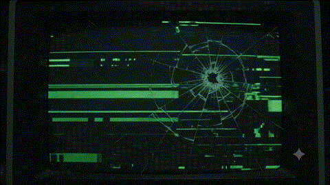

# ⚡ Shans Mohammed | Developer & Problem Solver

<div align="center">

  <!-- Hero Terminal Animation -->
  <a href="https://github.com/Abhinav-Abhilash/shans">
    
  </a>

  <br/><br/>

  <!-- Headline & Subtitle -->
  <h1><code>> Hello World! I'm Shans Mohammed 👋</code></h1>
  <p><strong>🚀 BCA Full-Stack Student at Jain University, Kochi | Tech Enthusiast | Sportsman</strong></p>

  <!-- Badges -->
  <p>
    <a href="https://jainuniversity.ac.in"></a>
    <a href="#-skills--tech-stack"></a>
    <a href="#-athletics--physical-stats"></a>
  </p>

  <p>
    <a href="https://vercel.com"></a>
    <a href="https://github.com/Abhinav-Abhilash/shans"></a>
    <a href="mailto:shansmohammed@example.com"></a>
  </p>

</div>

---

## 🖥️ `$ whoami`

```bash
shans@jain-university:~$ neofetch --profile
```

```yaml
Name:             Shans Mohammed
Current_Role:     BCA (Bachelor of Computer Applications) - Full-Stack Track
Institution:      Jain (Deemed-to-be University), Kochi Campus 🌴
Core_Languages:   Python, C++, SQL, JavaScript, HTML5/CSS3
DevOps & Cloud:   Git, GitHub, Vercel, Linux CLI
Superpowers:      Rapid Prototyping, Startup Architecture, Clean Code
Athletics:        Basketball, Football, Volleyball (Team Player & Endurance)
Current_Motto:    "Building the next big thing, one commit at a time."
```

---

## ⚡ Skills & Tech Stack

<div align="center">

### 💻 Programming & Database


### 🛠️ Platforms, Tools & Workflows


</div>

---

## 📊 Technical Capabilities Breakdown

| Domain | Technologies & Capabilities |
| :--- | :--- |
| **Backend & Logic** | **Python** (Automation, Data handling, Scripts) & **C++** (DSA, OOP, High Performance Algorithms) |
| **Frontend & Web** | **HTML5**, **CSS3**, modern **JavaScript (ES6+)**, Responsive UI, DOM Manipulation |
| **Databases** | **SQL** (Complex queries, Relational Schema Design, Normalization, Data Modeling) |
| **Version Control & CI/CD** | **GitHub** (Collaborative workflows, PRs, Issues, Actions) & **Vercel** (Instant Zero-Config Deployments) |
| **Startup & Product** | Idea Validation, Architectural Planning, Full-Stack System Design |

---

## 🏀 Athletics & Physical Stats

> *"High performance on the court breeds relentless focus in the terminal."*

In addition to writing code, physical discipline and team sports are central to how I operate:

- 🏀 **Basketball:** Fast decision-making under pressure, spatial awareness, and offensive transition play.
- ⚽ **Football:** Team coordination, high cardiovascular endurance, and tactical vision.
- 🏐 **Volleyball:** Explosive agility, reflex timing, and collaborative communication at the net.

---

## 📂 Featured Projects

| Project | Tech Stack | Description | Live / Repo |
| :--- | :--- | :--- | :--- |
| **Interactive Terminal Portfolio** | `HTML5` `CSS3` `JavaScript` `Vercel` | Retro CRT terminal with sound synthesizer and interactive command prompt. | [Live Demo ↗](https://vercel.com) • [Repo ↗](#) |
| **C++ High Performance Utilities** | `C++` `OOP` `Data Structures` | Optimized algorithms, memory management, and competitive programming solutions. | [Code ↗](#) |
| **Python Automation & Scraping** | `Python` `APIs` `SQL` | Automated data collection, data transformation, and SQL database pipelines. | [Code ↗](#) |
| **Relational Database Management** | `SQL` `Database Design` | Normalized relational database schema for campus management and student analytics. | [Queries & Schema ↗](#) |

---

## 📈 GitHub Activity & Stats

<div align="center">

  <!-- Note: Replace USERNAME with your actual GitHub username -->
  
  <br/>
  
  <br/>
  

</div>

---

## 🎓 Education

```txt
┌─────────────────────────────────────────────────────────────┐
│  Jain (Deemed-to-be University), Kochi Campus              │
│  Bachelor of Computer Applications (BCA) - Full Stack       │
│  Duration: 2024 - Present                                   │
│  Location: Infopark / Kakkanad, Kochi, Kerala, India        │
└─────────────────────────────────────────────────────────────┘
```

---

## 📬 Connect With Me

<div align="center">

  <a href="https://github.com/Abhinav-Abhilash/shans">
    
  </a>
  &nbsp;
  <a href="https://linkedin.com">
    
  </a>
  &nbsp;
  <a href="mailto:shansmohammed@example.com">
    
  </a>
  &nbsp;
  <a href="https://vercel.com">
    
  </a>

</div>

<br/>

<div align="center">
  <sub>Designed with 💚 for Shans Mohammed • Ready for GitHub Profile & Vercel</sub>
</div>
